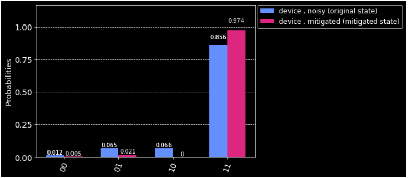

# Quantum-Error-Mitigation

This is an attempt to reduce the quantum noice we get when we run a circuit in a quantum computer. I used the Qiskit framework along with Jupyter Notebook to code a simple quantum circuit. The circuit should output 1 when the values of both the qubits is equal to 1 so the probability of getting the state *11* should be 100% if the Quantum Computer is an ideal Quantum Computer. But since that is not the case we do get the probabilities of some other states mixed with our expected answer (states like *10 01 00*). So I have tried to mitigate this quantum noise by using Qiskit Ignis.

**Note** : If you run this program on a Quantum Simulator you will get the probabity to the state *11* to be 100% cause the Simulator imitates an ideal Quantum Computer.

The project was successful and the results improved by 11.8%. It went from 0.856% probability of getting a *11* state to 0.974% probability to getting a *11* state.

## Results :-

### Before Correction

### After Correction

### Softwares and Libraries used 

- Jupyter Notebook
- Qiskit Terra 
- Qiskit Ignis
- Qiskit IBMQ-provider
- Matplotlib

-***The circuit was run 3000 times on the service backend : ibmq_london(5 qubits)*** 

